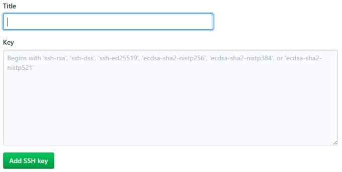

本文主要使用Hexo与Github进行个人blog的搭建
Hexo官网：[Hexo](https://hexo.io/zh-cn/)
Github官网：[Github](https://github.com/)

### 环境介绍
博主的本地环境为：MacBook Air M1，Macos 11.2.2，Homebrew 3.4.5

---


# 开始搭建
## 1.安装 node与npm
``` bash
$ brew install node
$ brew install npm

$ node
$ Welcome to Node.js v17.8.0.

$ npm -version
$ 8.6.0
```
---
## 2.安装Hexo
``` bash
# 使用npm安装Hexo
$ npm install hexo-cli -g

# 初始化Hexo blog
$ hexo init blog
```
本地blog初始化成功，本地路径为`/Users/username/blog`

---
## 3.Hexo主题选择
Hexo可在官网自由选择
官网主题：[HexoTheme](https://hexo.io/themes/)
***进入主题页面，点击图片可对主题进行预览，点击蓝色主题名称可进入相应的主题Github主页***

### （1）主题下载
```bash
#从终端进入blog项目中
$ cd blog
#使用git克隆相应主题到blog中
#格式：git clone [url] themes/xxx
#本博客采用Wikitten主题进行构建
$ git clone https://github.com/zthxxx/hexo-theme-Wikitten themes/Wikitten
```
### （2）主题配置
修改blog中的_config.yml文件

```yml
theme: Wikitten
```
具体配置移步到[Wikitten主题-中文文档](../../11/Wikitten主题中文文档)

---

## 4.Github配置

本地blog已经搭建完成，通过Github相应配置，即可将其部署到Github上。


### （1）注册Github账号
[Github-signup](https://github.com/signup?ref_cta=Sign+up&ref_loc=header+logged+out&ref_page=%2F&source=header-home)

### （2）Github SSH免密码配置
**1）设置user.name和user.email配置信息：**
```bash
git config --global user.name "你的GitHub用户名"
git config --global user.email "你的GitHub注册邮箱"
```

**2）查看本机是否存在`.ssh`文件**
```bash
$ cd ~/.ssh
$ ls
authorized_keys   id_rsa       known_hosts
config            id_rsa.pub
```
配置SHH免密码登录需要寻找一对`id_rsa`命名的文件，其中带`.pub` 扩展名的文件是公钥，另一个则为私钥。
如果没有找不到这样的文件（或者根本就没有.ssh目录）可以通过`ssh-keygen`程序来创建它们。

```bash
#邮箱填Github的注册邮箱
$ ssh-keygen -t rsa -C "xx@xx.com"
```
`ssh-keygen`会确认密钥的存储位置和文件名（默认是 .ssh/id_rsa）,然后他会要求你输入两次密钥口令，留空即可。所以一般选用默认，全部回车即可。

**3）Github配置**
登陆到GitHub，`右上角小头像->Setting->SSH and GPG keys`中，点击`new SSH key`。

`Title：`可以随便填写，但最好起的名字能让自己知道这个公钥是哪个设备的。
`Key：`将上面生成的.pub文件中的所有内容复制到这里。
点击下面的`Add SSH key`即可。
就可实现SSH免密码访问。

### （3）Github 远程仓库配置
**1）在github上创建一个仓库`username.github.io` `username`为自己的github用户名**

**2）安装hexo部署插件**
```bash
$ npm install hexo-deployer-git --save
```
**3）配置Blog的`_comfig.yml`文件**

```yml
# 配置hexo把blog部署到github仓库里
deploy:
  type: git
  repository: git@github.com:username/username.github.io.git
  branch: master
```
**4）使用`Hexo d`即可将Blog部署到Github上**

---

## 5.Hexo常用命令（三连）
```bash
#打开 Git bash
#清除生成的网页文件
$ hexo clean
#生成网页文件
$ hexo g
#上传网页文件到 Github page
$ hexo d
```
---

## 6.快捷命令
通过使用`alias`，触发一些命令的集合
在 `~/.bashrc` 文件中添加
```bash
$ alias hs='hexo clean && hexo g && hexo s'  #启动本地服务
$ alias hd='hexo clean && hexo g && hexo d && git add . && git commit -m "update" && git push -f'  #部署博客
$ source ~/.bashrc #刷新配置文件
```